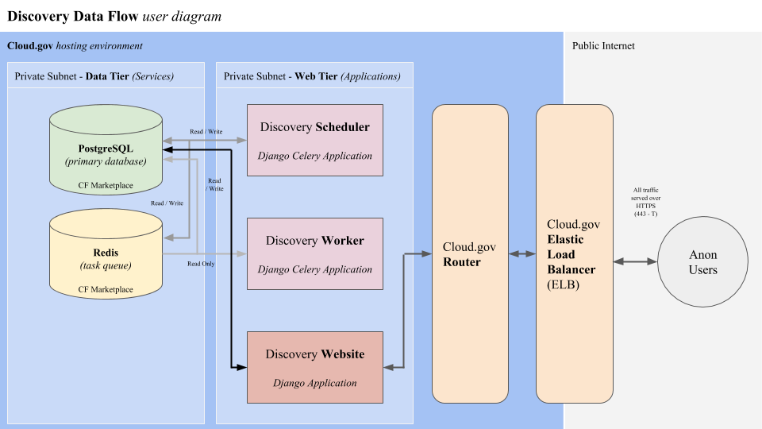

# Discovery system and frontend design

**<** [Technologies Required](technologies.md) | **^** **[Architecture Overview](readme.md)** | [Application Data](data.md) **>**

 

## Overview

The Discovery application system is built with a layered architecture of components, acccesses data from potentially diverse sources, and provides an ideally easy to use filtered search system to users looking for help during the market research phase of the acquisition lifecycle.

For a high level overview of the system architecture at the container and service level the following diagram depicts a Cloud.gov hosting environment and the data flow between high level components.

This document will review some of the internal architectural components within the above system instances.

 

## Configuration

All configurations in the Discovery applications _(website, worker, and scheduler)_ are passed as environment variables to the container to follow the [twelve factor application model](https://12factor.net/config).  This allows us to easily work between local Docker environment, CI/CD environment, and our remote hosting environments.

For a list of application specific environment variables that must be set for the application to function properly, see the [Docker getting started documentation](../start/docker.md).

### Local Docker configuration

The local Docker configuration is passed to running Django containers from an included **docker-compose.base.yml** file in the **docker** directory.  These configurations are merged with local private configurations to provide a fully configured Discovery application runtime environment _(See [Docker getting started](../start/docker.md) for more details)_

### CircleCI configuration

The PSHC CircleCI organization has a managed Discovery project that executes the CircleCI configuration in the **.circleci** directory.  This configuration defines some configuration parameters, which are then mixed with secure project defined environment variables and injected into the running application containers.

The CircleCI project requires all variables defined in the **docker/django-env.example.vars** file to be defined in the CircleCI environment interface.

It is also important when configuring CircleCI to deploy to a Cloud.gov environment that the proper credential variables are defined.  See the **deploy-dev.sh** and **deploy-prod.sh** scripts for these variables.  All container based jobs must share the same environment defined in the project interface, so we prefix the credentials with **DEV** or **PROD**.  The variables that must be set include;

 * (DEV/PROD)_SERVICE_ORG
 * (DEV/PROD)_SERVICE_SPACE
 * (DEV/PROD)_SERVICE_ACCOUNT
 * (DEV/PROD)_SERVICE_ACCOUNT_PASSWORD

All deployments from CircleCI to Cloud.gov require a service account and key that is active in a single Cloud Foundry space.

### Cloud.gov configuration

The Discovery application uses shared custom user provided service instances that define the environment variables listed in **docker/django-env.example.vars**.  These are then bound to all Django applications _(web, scheduler, workers)_.

This environment can be set up with the **scripts/setup-cf-space.sh --help** command.  See the command help information and source code for more information.

All service credentials, including our application centric environment variables, are passed via the **VCAP_SERVICES** environment variable to the running application containers.

 

## API

The core of the Discovery application is a simple API that serves up vendor, contract, and various other metadata relating to those data types.  This is defined as a RESTful interface with endpoints at http://localhost:8080/api.

For more information on the available endpoints see http://localhost:8080/docs.

 

## Website

The Discovery frontend interface is a filtered search of vendor and contract information pertaining to included Discovery vehicles.  All of the data that is served up to the frontend is available via the APIs discussed above.  The gateway to the website is: http://localhost:8080/ _(which should display a filter and overview information)_

### Django views and templates

The foundation of the Discovery interface are custom views that render templates that are scaffolding that gets filled out by frontend Javascript after initial page load.

### Jquery based Javascript application

Most of the data you see rendered on the Discovery web page during the search process is rendered by an [Angular JS](https://angularjs.org/) application that accesses the backend Django Discovery API and provides a single page app experience to site users built with the [US Web Design System](https://designsystem.digital.gov/).

The Django application passes a single environment variable through to the client side Javascript; **API_HOST**.

 * **API_HOST** - Full host of the discovery site providing the API _(e.g, http://localhost:8080)_

 

## Scheduler and worker processes

Continuously running in the background are internal servers continuously scheduling and processing tasks, which right now are just data updaters.

### Scheduling

The Celery Beat scheduler _(see [Discovery technologies](technologies.md))_ runs as a single application instance that checks for updates from the administrative scheduling interface and send tasks to the task processors via a Redis queue.

There should only ever be a single scheduler operating in an application space, as the schedulers might conflict and duplicate jobs.

We also initialize and run database updates on deployment of the scheduler, which prevents race conditions during migrations that can occur if we update the database on deployment of clustered web servers.

### Task processing

Celery based task processors _(at least one)_ are constantly checking the Redis task queue and running the appropriate task.  Task results are then reported back to the Discovery application through the PostgreSQL database.

Each task is a wrapper with special logic around a defined Django command.  The task provides a Celery registration, mutex lock, and output collection for reporting purposes.

There are currently only data update and cache population tasks defined in the system, but this will most likely expand in the future.

 
