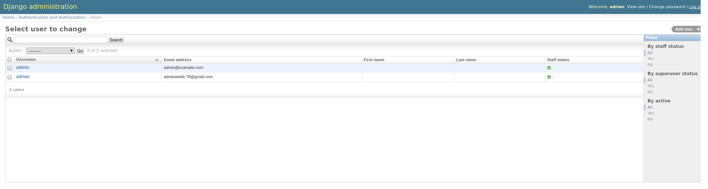
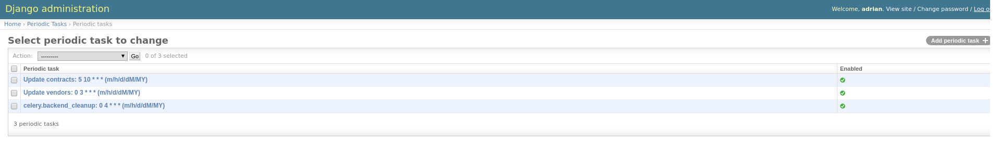
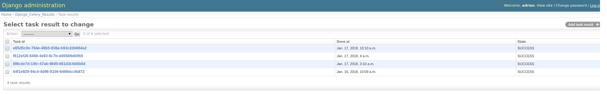

# Discovery setup

**<** [Discovery on Docker](docker.md) | **^** **[Getting Started](readme.md)**

<br/>

## User management

When up and running with the Discovery application, the first thing you will need to do is to ensure there is at least one administrative user for the system that can handle scheduling data update tasks in the system, and monitor their progress over time.

Both the local Docker environment and Cloud Foundry based buildpack deployments ensure an initial _super user_ with the username **admin**.  By default the password for this user is **admin-changeme**, but this can be reset through the administrative interface after logging in.  This account also has a dummy email by default, which should be changed.

_Note:_ The Discovery application does not currently send emails, so the user email entry is not currently used.

<br/>

### User related scripts

* Runs automatically on Scheduler deployment
* Run locally on any Django container top level project directory: **/discovery**, or through **docker exec**
* Run on Cloud Foundry with **cf run-task**

```bash
# Initialize the Django database and ensure an administrative user with the username admin
#
# This script is called on initialization of a new Django Celery Beat Scheduler, as there
# should only ever be a single Scheduler for a Discovery application cluster
#
$ scripts/init-db.sh  # Has no options

# Update or create an administrative user
$ scripts/create-admin.sh --help
```

<br/>

### User management interface

The user management interface can be found at: http://localhost:8080/admin/auth/user _(change port if different)_



<br/>

## Data loading

After the site is running and you have an administrative user that can login, you need to populate the site with data.  For most purposes a limited set of data useful for debugging and development of new features is preferable to complete repositories of information spanning potentially 10 years or longer.

When running the Discovery application you have two options; load data from packaged fixtures, or load data directly from the remote APIs that provide the source data for the production Discovery system.

<br/>

### 1. Loading from packaged fixtures

<br/>

###### Pros

 * Loading from fixtures is fast
 * Guaranteed to get same data as other developers
 * Not very memory or resource intensive

###### Cons

 * Data loaded is not up to date
 * Incomplete data available
 * Does not test update process

<br/>

#### Fixture related scripts

* Run locally on any Django container top level project directory: **/discovery**, or through **docker exec**
* Run on Cloud Foundry with **cf run-task**

```bash
# Loads all fixture data into the Discovery application
$ scripts/load-fixtures.sh  # Has no options

# Generate new fixture data with the data currently in the Discovery application
$ scripts/gen-fixtures.sh  # Has no options
```

<br/>

### 2. Loading from remote APIs

<br/>

###### Pros

 * Control the data you want _(to some degree)_
 * Data is up to date and may have parity with production
 * Data is complete and authoritive
 * Allows for testing of the update process

###### Cons

 * Loading from remote APIs can be slow
 * Not good for standardized tests _(eg; unit tests)_
 * Harder for collaborative development
 * Requires a stable internet connection

<br/>

#### Data loading related scripts and commands

* Run locally on any Django container top level project directory: **/discovery**, or through **docker exec**
* Run on Cloud Foundry with **cf run-task**

```bash
# Helper script that fetches all production time period data into the Discovery application
$ scripts/fetch-data.sh  # Has no options

# Load all classification information into Discovery (currently these are all local file based)
# - included in fetch-data.sh
$ manage.py load_categories  # Has no options

# Load all acquisition vehicle vendor information into Discovery
# - included in fetch-data.sh
$ manage.py load_vendors --help

# Load all contract awards and modification for all vendors in the Discovery database
# - included in fetch-data.sh
$ manage.py load_fpds --help
```

<br/>

#### Scheduled data updates

The Discovery application is built to periodically check for updates from remote sources based upon a schedule determined by a site administrator.  All data can be loaded initially through this mechanism as well, which is useful for testing the update mechanism.

This Django application uses the well documented, extensible, and popular background task processor called [Celery](http://docs.celeryproject.org/en/latest/django/first-steps-with-django.html) and an addon scheduling application built on a Celery extension; [Celery Beat](http://django-celery-beat.readthedocs.io/en/latest/).  These libraries provide an administrative interface that allows us to change the periodic schedule of updates, and audit background task results.

To schedule content updates, navigate to: http://localhost:8080/admin/django_celery_beat  _(change port if different)_

_You will notice four sections:_

 1. **Crontabs** - Very flexible schedule built on the [Cron scheduling format](https://en.wikipedia.org/wiki/Cron)
 2. **Intervals** - Simple scheduling format with an interval and unit of time _(e.g., 3 days)_
 3. **Solar Events** - Scheduling based on position of sun in relation to earth at geo coordinates _(you probably won't need this)_

 ---

 4. **Periodic Tasks** - Management of scheduled tasks that use the periods scheduled above _(a task can only have one scheduling event)_

<br/>

#### Task scheduling interface

The task scheduling interface can be found at: http://localhost:8080/admin/django_celery_beat/periodictask _(change port if different)_



_Creating a new scheduled task that **updates contracts** at **10:05AM UTC** everyday_


You can check on the results of executed tasks at http://localhost:8080/admin/django_celery_results/taskresult _(change port if different)_



<br/>

## Testing changes

The Discovery application is currently designed with two types of automated testing; unit tests and [Selenium](http://www.seleniumhq.org/docs/01_introducing_selenium.jsp) based acceptance testing through [PhantomJS](http://phantomjs.org/documentation).

The Discovery [CircleCI environment](https://circleci.com/docs/2.0/) is currently configured to run both unit tests and acceptance tests on pushes to branches and merges on the official PSHCDevOps source repository.

<br/>

#### Testing related scripts and commands

* Run locally on any Django container top level project directory: **/discovery**, or through **docker exec**
* Run on Cloud Foundry with **cf run-task**

```bash
# Install PhantomJS on the machine (only tested on Debian and Ubuntu for the Vagrant machine and CI containers)
#  - Already installed on Docker Django images
$ scripts/setup-phantomjs.sh  # Has no options

# Run all defined unit tests from Django api, vendors, and contract applications
#  - See CircleCI configuration for full usage example
$ manage.py test api vendors contract  # Has no options

# Run all defined Selenium acceptance tests (must have a Discovery site running at localhost:8080)
#  - See CircleCI configuration for full usage example
$ manage.py test selenium_tests  # Has no options
```

<br/>

## Deployment information

The Discovery application is hosted on Cloud.gov, a Cloud Foundry Platform as a Service provider.  All deployments to official staging and production spaces should be executed through the CircleCI CI/CD environment, but there is the occasional need to test aspects of the deployment in a non automated fashion.

The Discovery source repository contains various scripts useful for working with Cloud Foundry deployments when necessary.

<br/>

#### Deployment related scripts

* Run on either the **host** or **vagrant** machine (_if installed and used_)
* Run from the **top level project** directory

```bash
# Setup the Cloud Foundry CLI on the machine with necessary plugins for the Discovery deployment (only tested on Ubuntu and Debian)
#  - This is included on the Vagrant development machine
$ scripts/setup-cf.sh # No options

# Create and setup a space with a running Discovery application system from nothing
#  - This script can also update an existing space (e.g, configurations, service accounts, etc...)
#  - Need to be logged in to Cloud Foundry
$ scripts/setup-cf-space.sh  --help

# Contains functions used for deploying the Discovery application to Cloud Foundry, such as deploy_app
$ source scripts/deploy-base.sh

# Uses DEV environment variables with the deploy-base.sh functions to deploy to development environment
#  - Used by the CircleCI deployment process
$ scripts/deploy-dev.sh # No options

# Uses PROD environment variables with the deploy-base.sh functions to deploy to production environment
#  - Used by the CircleCI deployment process
$ scripts/deploy-prod.sh # No options

# Delete all Discovery application components and remove the specified Cloud Foundry space
$ scripts/delete-cf-space.sh --help
```

<br/>

## Documentation generation

<br/>

### Developer / Administrator documentation

The Discovery application generates a [documentation site](http://pshcdevops.github.io/discovery/index.html) created with Sphinx that gets automatically rebuilt on pushes to a **docs** branch or merges to **master** over time.

The root documentation folder is: **docs**.

<br/>

#### Development documentation related scripts

* Run locally on any Django container top level project directory: **/discovery**, or through **docker exec**
* Run on Cloud Foundry with **cf run-task**

```bash
# Deploy documentation site changes to GitHub site, via the gh-pages GitHub branch
#  - Used by the CircleCI deployment process
$ scripts/deploy-docs.sh --help
```

<br/>

### Compliance documentation

The Discovery application requires a government ATO to serve the public, so it requires compliance documentation that signifies how the information system or managing organization aheres to the relevant NIST standards and controls.  This documentation is currently housed in the **compliance** directory with a top level **opencontrol.yaml** file.

We use the [Compliance Masonry project](https://github.com/opencontrol/compliance-masonry) using the [Open Control schemas](https://github.com/opencontrol/schemas) to generate a Gitbook of the required control documentation.

<br/>

#### Compliance documentation related scripts

* Run on either the **host** or **vagrant** machine (_if installed and used_)
* Run from the **top level project** directory

```bash
# Setup the Compliance Masonry CLI on the machine (only tested on Ubuntu and Debian)
#  - This is included on the Vagrant development machine
$ scripts/setup-cm.sh # No options

# Generate a Gitbook formatted PDF with the included compliance documentation
$ scripts/create-security-docs.sh {../path/to/controls.pdf}
```

<br/>
